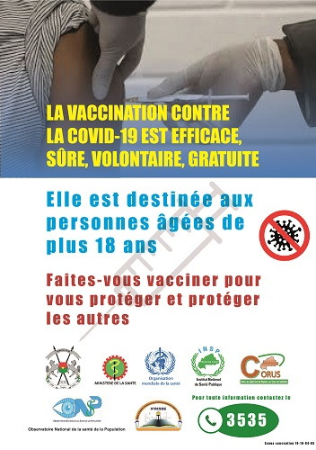
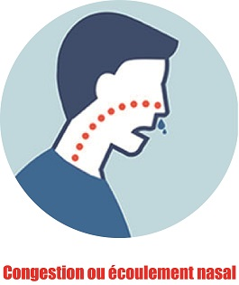
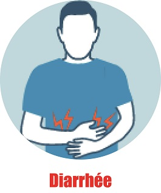
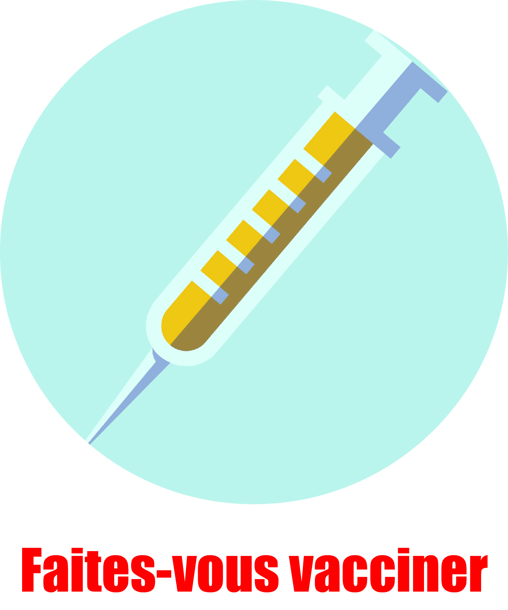
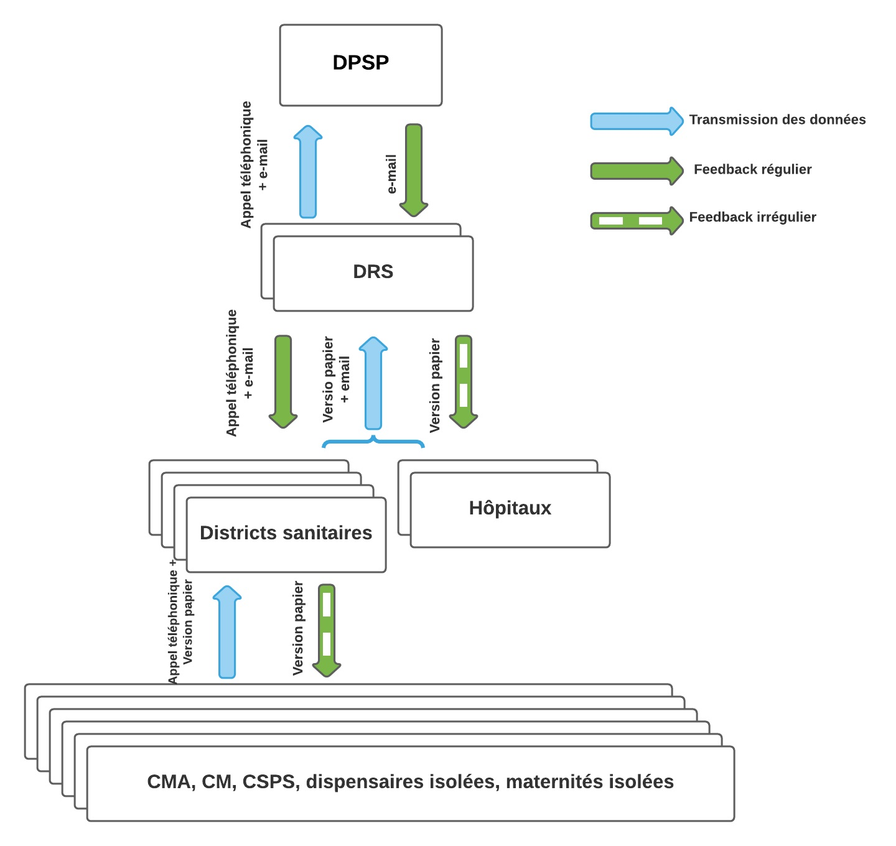

```{r setup, include=FALSE}
library(flexdashboard)
library(shiny)
library(tidyverse)
library(bslib)
library(readxl)
library(shinydashboard)
library(plotly)
library(rAmCharts)
library(scales)

```

```{r}
#Base de données TLOH
library(readxl)
Base <- read_excel("Data/Base.xlsx")

#Base de données vaccin
Vaccin <- read_excel("Data/Vaccin.xlsx")


```


Accueil{data-icon="fa-home"}
=============================================
Sidebar {.sidebar}
---------------------------------------------

```{r}
img(src = "www/ONSP.jpg",
    height = 105,
    width = 240)
```

```{r}
sidebarSearchForm("searchText",
                  "buttonSearch",
                  "Taper ici pour rechercher",
                  icon = shiny::icon("search"))
```

```{r}
selectInput(
  "District_vaccin",
  h4(strong("DISTRICT"), style = "color: #232EA3"),
  choices = Vaccin %>%
    select(District) %>%
    distinct() %>%
    arrange(District) %>%
    drop_na()
)
```

```{r}
HTML("<iframe name='date du jour' id='date-du-jour' style='width:105px;height:75px;' src='https://www.mathieuweb.fr/calendrier/date-jour-bleu2.html' scrolling='no' frameborder='0' allowtransparency='true'></iframe>
")
```

```{r}
dateInput(
  "Date_maj",
  h4(strong("DONNÉES DU :"), style = "color: #232EA3"),
  value = Sys.Date() - 1,
  format = "dd/mm/yyyy"
)
```


```{r}

#------------------ Parameters ------------------
# Set colors
# https://www.w3.org/TR/css-color-3/#svg-color
confirmed_color <- "red"
recovered_color <- "forestgreen"
death_color <- "purple"
vaccin_color <- "magenta"

#Données covid
Confirmes <- 20729
deces <- 375
vaccine <- 771895


virg <- dollar_format(prefix = "",suffix="")
```

Row {data-height=30}
----------------------------------------------------------
```{r}
HTML("<marquee 
        behavior='alternate' 
        direction='left' 
        scrollamount='5'
        onmousedown='this.stop();'
        onmouseup='this.start();'> 
     <h4> 
     INFORMATIONS SUR LA COVID-19 AU BURKINA FASO
     </h4>
     </marquee>
     ")
```


Row
----------------------------------------------------------

### confirmed {.value-box}

```{r}
flexdashboard::valueBox(value = virg(Confirmes) , 
         caption = "CAS CONFIRMÉS", 
         icon = "fas fa-user-md", 
         color = confirmed_color)
```

### death {.value-box}

```{r}
flexdashboard::valueBox(value = deces,
         caption = "DÉCÈS", 
         icon = "fas fa-heart-broken", 
         color = death_color)
```


### recovered {.value-box}

```{r}
flexdashboard::valueBox(value = virg(Confirmes - deces), 
         caption = "GUÉRIS", icon = "fas fa-heartbeat", 
         color = recovered_color)
```

### vaccined {.value-box}

```{r}
flexdashboard::valueBox(value = virg(vaccine) , 
         caption = "VACCINÉS", icon = "fas fa-syringe", 
         color = vaccin_color)
```


Row
----------------------------------------------------------
### Site de vaccination dans la région du Centre

```{r fig.width=12}
DT::renderDataTable({
  Site <- Vaccin %>%
    filter(District == input$District_vaccin) %>%
    select(-Id) %>%
    rename("Vaccin disponibe" = Vaccin)
  
  DT::datatable(
    Site,
    options = list(
      bPaginate = T,
      pageLength = 8,
      dom = 'tip'
    ),
    rownames = FALSE,
    colnames = c(
      'DISTRICTS SANITAIRES',
      'SITES DE VACCINATION',
      'VACCINS DISPONIBLES'
    ),
    caption = htmltools::tags$caption(
      style = 'caption-side: bottom; text-align: center;',
      'Source: ',
      htmltools::em(
        'Ministère de la Santé, de l\'Hygiène Publique et du Bien-être'
        )
    )
  )
})
```

###
```{r}
HTML(
  "<marquee behavior='scroll' 
           direction='left'
           scrollamount='5'
           vspace='50px'
           hspace='2px'
           onmousedown='this.stop();'
           onmouseup='this.start();'>
      
     
      
     
      
      
     </marquee>"
)
```


Statistiques {data-navmenu="COVID-19" data-icon="fa-chart-bar"}
=============================================
Sidebar {.sidebar}
---------------------------------------------

```{r}
img(src = "www/ONSP.jpg",
    height = 105,
    width = 240)
```

```{r}
sidebarSearchForm("searchText","buttonSearch","Taper ici pour rechercher",
  icon = shiny::icon("search"))
```

```{r}
selectInput(
  "Region_covid",
  h4(strong("REGION"), style = "color: #232EA3"),
  choices = Base %>%
    select(REGION) %>%
    distinct() %>%
    arrange(REGION) %>%
    drop_na(),
  selected = "Centre"
)
```


```{r}
selectInput("District_covid",
            h4(strong("DISTRICT"), style = "color: #232EA3"),
            choices = NULL)
```

```{r}
dateRangeInput(
  "date1",
  h4(strong("DATES"), style = "color: #232EA3"),
  start = "2020-03-09",
  end = Sys.Date(),
  min = "2020-03-09",
  max = Sys.Date(),
  width = "700px"
)
```


Row {.tabset .tabset-fade}
-------------------------------------
```{r}

observeEvent((input$Region_covid), {
  if (input$Region_covid == "") {
    fa <- unique(Base$REGION)
  }
  else
    fa <- input$Region_covid
  choices <- c(unique(Base$district[Base$REGION %in% fa]))
  updateSelectInput(inputId = "District_covid",
                    choices = choices,
                    selected = choices[1])
})
```

### Cas confirmés 

```{r}
plotlyOutput("Covid_cas")

output$Covid_cas <- renderPlotly({
  Base <-
    Base[Base$DATE > input$date1[1] & Base$DATE < input$date1[2],]
  Base %>%
    filter(REGION == input$Region_covid) %>%
    select(DATE,
           covid_cas) %>%
    gather(key = "Variables", value = "Cas", -DATE) %>%
    group_by(DATE) %>%
    summarise(Cas = sum(Cas)) %>%
    plot_ly(
      x = ~ DATE,
      y = ~ Cas,
      type = "scatter",
      mode = "lines+markers"
      ,
      color = I("violet"),
      line = list(shape = "spline")
    ) %>%
    layout(
      title = paste(
        "Cas confirmés de covid-19 ( Région:", 
        input$Region_covid, ")") ,
      xaxis = list(
        title = "Date",
        range = max(Base$DATE) - 7,
        max(Base$DATE),
        rangeslider = list(visible = F),
        rangeselector = list(buttons = list(
          list(
            count = 7,
            label = "Semaine",
            step = "day"
          ),
          list(
            count = 1,
            label = "Mois",
            step = "month"
          ),
          list(step = "all")
        ))
      ),
      yaxis = list(title = "Nombre de cas")
    )
})
```

### Décès dus à la Covid 
```{r}
plotlyOutput("covid_deces")

output$covid_deces <- renderPlotly({
  Base <-
    Base[Base$DATE > input$date1[1] & Base$DATE < input$date1[2],]
  Base %>%
    filter(REGION == input$Region_covid) %>%
    select(DATE,
           covid_deces) %>%
    gather(key = "Variables", value = "Cas", -DATE) %>%
    group_by(DATE) %>%
    summarise(Cas = sum(Cas)) %>%
    plot_ly(
      x = ~ DATE,
      y = ~ Cas,
      type = "scatter",
      mode = "lines+markers",
      color = I("red"),
      line = list(shape = "spline")
    ) %>%
    layout(
      title = paste(
        "Décès dus à la covid-19 ( Région:", 
        input$Region_covid, ")"),
      xaxis = list(
        title = "Date",
        range = max(Base$DATE) - 7,
        max(Base$DATE),
        rangeslider = list(visible = F),
        rangeselector = list(buttons = list(
          list(
            count = 7,
            label = "Semaine",
            step = "day"
          ),
          list(
            count = 1,
            label = "Mois",
            step = "month"
          ),
          list(step = "all")
        ))
      ),
      yaxis = list(title = "Nombre de décès")
    )
})
```


### Létalité du covid 

```{r}
plotlyOutput("covid_letal")

output$covid_letal <- renderPlotly({
  Base <- Base[Base$DATE>input$date1[1] & Base$DATE<input$date1[2],]
  Base %>%
    filter(REGION == input$Region_covid) %>%
    select(DATE,
           covid_letal) %>%
    gather(key = "Variables", value = "Cas", -DATE) %>%
    group_by(DATE) %>% 
    summarise(Cas = sum(Cas)) %>% 
    plot_ly(
      x = ~ DATE,
      y = ~ Cas,
      type = "scatter",
      mode = "lines+markers"
      ,
      color = I("orange"),
      line = list(shape = "spline")
    ) %>%
    layout(
      title = paste(
        "Létalité de la covid-19 ( Région:", 
        input$Region_covid, ")"),
      xaxis = list(
        title = "Date",
        range = max(Base$DATE) - 7,
        max(Base$DATE),
        rangeslider = list(visible = F),
        rangeselector = list(buttons = list(
          list(
            count = 7,
            label = "Semaine",
            step = "day"
          ),
          list(
            count = 1,
            label = "Mois",
            step = "month"
          ),
          list(step = "all")
        ))
      ),
      yaxis = list(title = "Létalité")
    )
})
```


Row {.tabset .tabset-fade}
-------------------------------------

### Cas confirmés 

```{r}
plotlyOutput("Covid_cas1")

output$Covid_cas1 <- renderPlotly({
  Base <- Base[Base$DATE>input$date1[1] & Base$DATE<input$date1[2],]
  Base %>%
    filter(district == input$District_covid) %>%
    select(DATE,
           covid_cas) %>%
    gather(key = "Variables", value = "Cas", -DATE) %>%
    plot_ly(
      x = ~ DATE,
      y = ~ Cas,
      type = "scatter",
      mode = "lines+markers"
      ,
      color = I("violet"),
      line = list(shape = "spline")
    ) %>%
    layout(
      title = paste(
        "Cas confirmés de covid-19 ( District:", 
        input$District_covid, ")"),
      xaxis = list(
        title = "Date",
        range = max(Base$DATE) - 7,
        max(Base$DATE),
        rangeslider = list(visible = F),
        rangeselector = list(buttons = list(
          list(
            count = 7,
            label = "Semaine",
            step = "day"
          ),
          list(
            count = 1,
            label = "Mois",
            step = "month"
          ),
          list(step = "all")
        ))
      ),
      yaxis = list(title = "Nombre de cas")
    )
})
```

### Décès dus à la Covid 
```{r}
plotlyOutput("covid_deces1")

output$covid_deces1 <- renderPlotly({
  Base <- Base[Base$DATE>input$date1[1] & Base$DATE<input$date1[2],]
  Base %>%
    filter(district == input$District_covid) %>%
    select(DATE,
           covid_deces) %>%
    gather(key = "Variables", value = "Cas", -DATE) %>%
    plot_ly(
      x = ~ DATE,
      y = ~ Cas,
      type = "scatter",
      mode = "lines+markers",
      color = I("red"),
      line = list(shape = "spline")
    ) %>%
    layout(
      title = paste(
        "Décès dus à la covid-19 ( District:", 
        input$District_covid, ")"),
      xaxis = list(
        title = "Date",
        range = max(Base$DATE) - 7,
        max(Base$DATE),
        rangeslider = list(visible = F),
        rangeselector = list(buttons = list(
          list(
            count = 7,
            label = "Semaine",
            step = "day"
          ),
          list(
            count = 1,
            label = "Mois",
            step = "month"
          ),
          list(step = "all")
        ))
      ),
      yaxis = list(title = "Nombre de Décès")
    )
})
```


### Létalité du covid 

```{r}
plotlyOutput("covid_letal1")

output$covid_letal1 <- renderPlotly({
  Base <- Base[Base$DATE > input$date1[1] & Base$DATE < input$date1[2], ]
  Base %>%
    filter(district == input$District_covid) %>%
    select(DATE,
           covid_letal) %>%
    gather(key = "Variables", value = "Cas",-DATE) %>%
    plot_ly(
      x = ~ DATE,
      y = ~ Cas,
      type = "scatter",
      mode = "lines+markers"
      ,
      color = I("orange"),
      line = list(shape = "spline")
    ) %>%
    layout(
      title = paste(
        "Létalité de la covid-19 ( District:",
        input$District_covid,
        ")"
      ),
      xaxis = list(
        title = "Date",
        range = max(Base$DATE) - 7,
        max(Base$DATE),
        rangeslider = list(visible = F),
        rangeselector = list(buttons = list(
          list(
            count = 7,
            label = "Semaine",
            step = "day"
          ),
          list(
            count = 1,
            label = "Mois",
            step = "month"
          ),
          list(step = "all")
        ))
      ),
      yaxis = list(title = "Létalité")
    )
})
```

Symptômes {data-navmenu="COVID-19" data-icon="fa-virus"}
=============================================
Row
-------------------------------------
###

```{r fig.width=10}
HTML("<div class='body'>
<h2><b>SYMPTÔMES</b></h2>
<p>La COVID-19 affecte différentes personnes de différentes manières. 
La plupart des personnes infectées développeront une maladie légère à modérée et
se rétabliront sans hospitalisation.</p>

<div class='point'>Symptômes les plus courants :</div>
<p><ul>
  <li>fièvre</li>
  <li>toux</li>
  <li>fatigue</li>
  <li>perte de goût ou d'odorat</li>
</ul></p>

<div class='point'>Symptômes moins courants :</div>
<p><ul>
  <li>maux de gorge</li>
  <li>mal de tête</li>
  <li>maux et douleurs</li>
  <li>la diarrhée</li>
  <li>une éruption cutanée ou une décoloration des doigts ou des orteils</li>
  <li>yeux rouges ou irrités</li>
</ul></p>

<div class='point'>Symptômes graves :</div>
<p><ul>
  <li>difficulté à respirer ou essoufflement</li>
  <li>perte de la parole ou de la mobilité, ou confusion</li>
  <li>douleur thoracique</li>
</ul></p>

<p>Consultez immédiatement un médecin si vous présentez des symptômes graves. 
Appelez toujours avant de consulter votre médecin ou votre établissement de 
santé.</p>

<p>Les personnes présentant des symptômes légers qui sont par ailleurs en bonne 
santé devraient gérer leurs symptômes à la maison.
En moyenne, il faut 5 à 6 jours à partir du moment où une personne est infectée 
par le virus pour que les symptômes se manifestent, mais cela peut prendre 
*jusqu'à 14 jours.</p>

<div class='info'><p><em>À titre informatif seulement. Consultez votre autorité 
médicale locale 
pour obtenir des conseils.</em></p></div>
</div>")
```

###
```{r}
HTML("
  <marquee behavior='scroll' 
           direction='left' 
           scrollamount='4'
           vspace='100px'
           onmousedown='this.stop();'
           onmouseup='this.start();'>
      
      
     
      
     
     </marquee>"
)
```

Prévention {data-navmenu="COVID-19" data-icon="fa-head-side-mask"}
=============================================
Row
-------------------------------------
###

```{r fig.width=10}
HTML("<div class='body'>
<h2><b>PRÉVENTION</b></h2>
<p>Protégez-vous et protégez les autres autour de vous en connaissant les faits 
et en prenant les précautions appropriées. Suivez les conseils fournis par votre
autorité sanitaire locale.</p>

<p>Vérifiez auprès de votre autorité sanitaire locale les conseils les plus 
pertinents pour votre région.</p>

<div class='point'>Pour éviter la propagation de la COVID-19 :</div>
<p><ul>
  <li>Maintenez une distance de sécurité avec les autres (au moins 1 mètre),
  même s'ils ne semblent pas malades.</li>
  <li>Portez un masque en public, en particulier à l'intérieur ou lorsque 
  la distanciation physique n'est pas possible.</li>
  <li>Choisissez des espaces ouverts et bien ventilés plutôt que des espaces 
  fermés. Ouvrez une fenêtre si vous êtes à l'intérieur.</li>
  <li>Nettoyez-vous souvent les mains. Utilisez de l'eau et du savon ou un 
  désinfectant pour les mains à base d'alcool.</li>
  <li>Faites-vous vacciner quand c'est votre tour. Suivez les directives locales 
  sur la vaccination.</li>
  <li>Couvrez-vous le nez et la bouche avec votre coude plié ou un mouchoir 
  lorsque vous toussez ou éternuez.</li>
  <li>Restez à la maison si vous ne vous sentez pas bien.</li>
  <li>Si vous avez de la fièvre, de la toux et des difficultés respiratoires, 
  consultez un médecin. Appelez à l'avance afin que votre fournisseur de soins
  de santé puisse vous diriger vers le bon établissement de santé. Cela vous 
  protège et empêche la propagation des virus et autres infections.</li>
</ul></p>

<div class='point'>Masques</div>

<p>Des masques bien ajustés peuvent aider à prévenir la propagation du virus de 
la personne portant le masque aux autres. Les masques seuls ne protègent pas 
contre le COVID-19 et doivent être associés à la distanciation physique et à 
l'hygiène des mains. Suivez les conseils fournis par votre autorité sanitaire 
locale.</p>

<div class='info'><p><em>À titre informatif seulement. Consultez votre autorité 
médicale locale 
pour obtenir des conseils.</em></p></div>
</div>")
```
###
```{r}
HTML("
  <marquee behavior='scroll' 
           direction='left' 
           scrollamount='4'
           vspace='100px'
           onmousedown='this.stop();'
           onmouseup='this.start();'>
      
      
     
      
     
     </marquee>"
)
```


Dépistage {data-navmenu="COVID-19" data-icon="fa-microscope"}
=============================================
```{r}
HTML("<div class='body'>
<h2><b>DÉPISTAGE</b></h2>
<p>Rendez-vous sur le  <a href='https://www.sante.gov.bf/detail?tx_news_pi1%5Baction%5D=detail&tx_news_pi1%5Bcontroller%5D=News&tx_news_pi1%5Bnews%5D=434&cHash=3ed8135bdf139fd1b2c0ae6129195684'> site
</a> du Ministère de la Santé de l'Hygiène Publique et du Bien-être du Burkina Faso pour les informations sur le dépistage de la Covid au Burkina Faso</p>
</div>")
```


Traitement {data-navmenu="COVID-19" data-icon="fa-user-nurse"}
=============================================
Row
-------------------------------------
###

```{r}
HTML("<div class='body'>
<h2><b>TRAITEMENTS</b></h2>

<div class='point'><b>Soins auto-administrés</b></div>
<p>Après avoir été exposé à une personne atteinte de la COVID-19, procédez 
comme suit :</p>
<p><ul>
  <li>Appelez votre fournisseur de soins de santé ou la hotline COVID-19 pour 
  savoir où et quand passer un test.</li>
  <li>Coopérez avec les procédures de recherche des contacts pour arrêter la
  propagation du virus.</li>
  <li>Si les tests ne sont pas disponibles, restez à la maison et loin des 
  autres pendant 14 jours.</li>
  <li>perte de goût ou d'odorat</li>
  <li>Pendant que vous êtes en quarantaine, n'allez pas au travail, à l'école 
  ou dans les lieux publics. Demandez à quelqu'un de vous apporter des 
  fournitures.</li>
  <li>Gardez au moins 1 mètre de distance avec les autres, même avec les membres
  de votre famille.</li>
  <li>Portez un masque médical pour protéger les autres, y compris si/quand vous
  devez consulter un médecin.</li>
  <li>Lavez-vous fréquemment les mains.</li>
  <li>Restez dans une pièce séparée des autres membres de la famille et, si ce 
  n'est pas possible, portez un masque médical.</li>
  <li>Gardez la pièce bien aérée.</li>
  <li>Si vous partagez une chambre, placez les lits à au moins 1 mètre l'un de 
  l'autre.</li>
  <li>Surveillez-vous pour tout symptôme pendant 14 jours.</li>
  <li>Appelez immédiatement votre fournisseur de soins de santé si vous 
  présentez l'un de ces signes de danger : difficulté à respirer, perte de 
  la parole ou de la mobilité, confusion ou douleur thoracique.</li>
  <li>Restez positif en restant en contact avec vos proches par téléphone ou 
  en ligne, et en faisant de l'exercice à la maison.</li>
</ul></p>

<div class='info'><p><em><a href='https://www.who.int/'>
  En savoir plus sur who.int
</a></em></p></div>

<div class='info'><p><em>À titre informatif seulement. Consultez votre autorité
médicale locale pour obtenir des conseils.</em></p></div>

<div class='info'><p><em>Consultez immédiatement un médecin si vous présentez 
symptômes graves. Appelez toujours avant de consulter votre médecin ou votre 
établissement de santé.</em></p></div></br>

<div class='point'><b>Des traitements médicaux</b></div>

<p>Des scientifiques du monde entier travaillent à trouver et à développer des 
traitements pour le COVID-19.
Les soins de soutien optimaux comprennent l'oxygène pour les patients gravement 
malades et ceux qui sont à risque de maladie grave et une assistance 
respiratoire plus avancée telle que la ventilation pour les patients gravement 
malades.
La dexaméthasone est un corticostéroïde qui peut aider à réduire la durée 
d'utilisation d'un ventilateur et à sauver la vie de patients atteints 
d'une maladie grave et critique.
L'OMS ne recommande pas l'automédication avec des médicaments, y compris 
des antibiotiques, pour prévenir ou guérir le COVID-19.</p>

<div class='info'><p><em><a href='https://www.who.int/'>
  En savoir plus sur who.int
</a></em></p></div>

<div class='info'><p><em>À titre informatif seulement. Consultez votre autorité 
médicale locale pour obtenir des conseils.</em></p></div>
</div>")
```


Vaccination {data-navmenu="COVID-19" data-icon="fa-syringe"}
=============================================

```{r}
HTML("<div class='body'>
<h2><b>Vaccination</b></h2>
<p>Rendez-vous sur le  <a href='https://www.afro.who.int/fr/news/le-burkina-faso-intensifie-la-vaccination-contre-la-covid-19'> ici
</a> pour avoir l'actualité de la vaccination de la Covid au Burkina Faso</p>
</div>")
```

Méningite
=====================================
Sidebar {.sidebar}
---------------------------------------------

```{r}
img(src = "www/ONSP.jpg", height = 105, width = 240)
```

```{r}
sidebarSearchForm("searchText",
                  "buttonSearch",
                  "Taper ici pour rechercher",
                  icon = shiny::icon("search"))
```

```{r}
selectInput(
  "Annee_mening",
  h4(strong("ANNEE"), style = "color: #232EA3"),
  choices = Base %>%
    select(Annee) %>%
    distinct()
)
```

```{r}
selectInput(
  "Region_mening",
  h4(strong("REGION"), style = "color: #232EA3"),
  choices = Base %>%
    select(REGION) %>%
    distinct() %>%
    arrange(REGION) %>%
    drop_na()
)
```


```{r}
selectInput("District_mening",
            h4(strong("DISTRICT"), style = "color: #232EA3"),
            choices = NULL)
```


Row {.tabset .tabset-fade}
-------------------------------------
```{r}
observeEvent((input$Region_mening), {
  if (input$Region_mening == "") {
    fa <- unique(Base$REGION)
  }
  else
    fa <- input$Region_mening
  choices <- c(unique(Base$district[Base$REGION %in% fa]))
  updateSelectInput(inputId = "District_mening",
                    choices = choices,
                    selected = choices[1])
})
```

### Cas de méningite 

```{r}
plotlyOutput("mening_cas")

output$mening_cas <- renderPlotly({
  Base %>%
    filter(REGION == input$Region_mening &
             Annee == input$Annee_mening) %>%
    select(DATE,
           mening_cas) %>%
    gather(key = "Variables", value = "Cas",-DATE) %>%
    group_by(DATE) %>%
    summarise(Cas = sum(Cas)) %>%
    plot_ly(
      x = ~ DATE,
      y = ~ Cas,
      type = "scatter",
      mode = "lines+markers"
      ,
      color = I("violet"),
      line = list(shape = "spline")
    ) %>%
    layout(
      title = paste(
        "Cas de méningite ( Région:",
        input$Region_mening,
        input$Annee_mening,
        ")"
      ),
      xaxis = list(
        title = "Date",
        range = max(Base$DATE) - 7,
        max(Base$DATE),
        rangeslider = list(visible = F),
        rangeselector = list(buttons = list(
          list(
            count = 7,
            label = "Semaine",
            step = "day"
          ),
          list(
            count = 1,
            label = "Mois",
            step = "month"
          ),
          list(step = "all")
        ))
      ),
      yaxis = list(title = "Nombre de cas")
    )
})
```


### Décès dus à la méningite 
```{r}
plotlyOutput("mening_deces")

output$mening_deces <- renderPlotly({
  Base %>%
    filter(REGION == input$Region_mening &
             Annee == input$Annee_mening) %>%
    select(DATE,
           mening_deces) %>%
    gather(key = "Variables", value = "Cas",-DATE) %>%
    group_by(DATE) %>%
    summarise(Cas = sum(Cas)) %>%
    plot_ly(
      x = ~ DATE,
      y = ~ Cas,
      type = "scatter",
      mode = "lines+markers"
      ,
      color = I("red"),
      line = list(shape = "spline")
    ) %>%
    layout(
      title = paste(
        "Décès dus à la méningite ( Région:",
        input$Region_mening,
        input$Annee_mening,
        ")"
      ),
      xaxis = list(
        title = "Date",
        range = max(Base$DATE) - 7,
        max(Base$DATE),
        rangeslider = list(visible = F),
        rangeselector = list(buttons = list(
          list(
            count = 7,
            label = "Semaine",
            step = "day"
          ),
          list(
            count = 1,
            label = "Mois",
            step = "month"
          ),
          list(step = "all")
        ))
      ),
      yaxis = list(title = "Nombre de décès")
    )
})
```

### Létalité de la méningite (%)
```{r}
plotlyOutput("mening_letal")

output$mening_letal <- renderPlotly({
  Base %>%
    filter(REGION == input$Region_mening &
             Annee == input$Annee_mening) %>%
    select(DATE,
           mening_letal) %>%
    gather(key = "Variables", value = "Cas",-DATE) %>%
    group_by(DATE) %>%
    summarise(Cas = sum(Cas)) %>%
    plot_ly(
      x = ~ DATE,
      y = ~ Cas,
      type = "scatter",
      mode = "lines+markers",
      color = I("orange"),
      line = list(shape = "spline")
    ) %>%
    layout(
      title = paste(
        "Létalité de la méningite ( Région:",
        input$Region_mening,
        input$Annee_mening,
        ")"
      ),
      xaxis = list(
        title = "Date",
        range = max(Base$DATE) - 7,
        max(Base$DATE),
        rangeslider = list(visible = F),
        rangeselector = list(buttons = list(
          list(
            count = 7,
            label = "Semaine",
            step = "day"
          ),
          list(
            count = 1,
            label = "Mois",
            step = "month"
          ),
          list(step = "all")
        ))
      ),
      yaxis = list(title = "Létalité")
    )
})
```


### Taux d'attaque de la méningite (P.100000)
```{r}
plotlyOutput("attaq_mening")


output$attaq_mening <- renderPlotly({
  Base %>%
    filter(REGION == input$Region_mening &
             Annee == input$Annee_mening) %>%
    select(DATE,
           mening_txattaq) %>%
    gather(key = "Variables", value = "Cas",-DATE) %>%
    group_by(DATE) %>%
    summarise(Cas = sum(Cas)) %>%
    plot_ly(
      x = ~ DATE,
      y = ~ Cas,
      type = "scatter",
      mode = "lines+markers",
      color = I("blue"),
      line = list(shape = "spline")
    ) %>%
    layout(
      title = paste(
        "Taux d'attaque de la méningite ( Région:",
        input$Region_mening,
        input$Annee_mening,
        ")"
      ),
      xaxis = list(
        title = "Date",
        range = max(Base$DATE) - 7,
        max(Base$DATE),
        rangeslider = list(visible = F),
        rangeselector = list(buttons = list(
          list(
            count = 7,
            label = "Semaine",
            step = "day"
          ),
          list(
            count = 1,
            label = "Mois",
            step = "month"
          ),
          list(step = "all")
        ))
      ),
      yaxis = list(title = "Taux")
    )
})
```


Row {.tabset .tabset-fade}
-------------------------------------
### Cas de méningite 

```{r}
plotlyOutput("mening_cas1")

output$mening_cas1 <- renderPlotly({
  Base %>%
    filter(district == input$District_mening &
             Annee == input$Annee_mening) %>%
    select(DATE,
           mening_cas) %>%
    gather(key = "Variables", value = "Cas",-DATE) %>%
    plot_ly(
      x = ~ DATE,
      y = ~ Cas,
      type = "scatter",
      mode = "lines+markers"
      ,
      color = I("violet"),
      line = list(shape = "spline")
    ) %>%
    layout(
      title = paste(
        "Cas de méningite ( District:",
        input$District_mening,
        input$Annee_mening,
        ")"
      ),
      xaxis = list(
        title = "Date",
        range = max(Base$DATE) - 7,
        max(Base$DATE),
        rangeslider = list(visible = F),
        rangeselector = list(buttons = list(
          list(
            count = 7,
            label = "Semaine",
            step = "day"
          ),
          list(
            count = 1,
            label = "Mois",
            step = "month"
          ),
          list(step = "all")
        ))
      ),
      yaxis = list(title = "Nombre de cas")
    )
})
```


### Décès dus à la méningite 
```{r}
plotlyOutput("mening_deces1")

output$mening_deces1 <- renderPlotly({
  Base %>%
    filter(district == input$District_mening &
             Annee == input$Annee_mening) %>%
    select(DATE,
           mening_deces) %>%
    gather(key = "Variables", value = "Cas",-DATE) %>%
    plot_ly(
      x = ~ DATE,
      y = ~ Cas,
      type = "scatter",
      mode = "lines+markers",
      color = I("red"),
      line = list(shape = "spline")
    ) %>%
    layout(
      title = paste(
        "Décès dus à la méningite ( District:",
        input$District_mening,
        input$Annee_mening,
        ")"
      ),
      xaxis = list(
        title = "Date",
        range = max(Base$DATE) - 7,
        max(Base$DATE),
        rangeslider = list(visible = F),
        rangeselector = list(buttons = list(
          list(
            count = 7,
            label = "Semaine",
            step = "day"
          ),
          list(
            count = 1,
            label = "Mois",
            step = "month"
          ),
          list(step = "all")
        ))
      ),
      yaxis = list(title = "Nombre de décès")
    )
})
```

### Létalité de la méningite (%)
```{r}
plotlyOutput("mening_letal1")

output$mening_letal1 <- renderPlotly({
  Base %>%
    filter(district == input$District_mening &
             Annee == input$Annee_mening) %>%
    select(DATE,
           mening_letal) %>%
    gather(key = "Variables", value = "Cas",-DATE) %>%
    plot_ly(
      x = ~ DATE,
      y = ~ Cas,
      type = "scatter",
      mode = "orange",
      color = I("orange"),
      line = list(shape = "spline")
    ) %>%
    layout(
      title = paste(
        "Létalité de la méningite ( District:",
        input$District_mening,
        input$Annee_mening,
        ")"
      ),
      xaxis = list(
        title = "Date",
        range = max(Base$DATE) - 7,
        max(Base$DATE),
        rangeslider = list(visible = F),
        rangeselector = list(buttons = list(
          list(
            count = 7,
            label = "Semaine",
            step = "day"
          ),
          list(
            count = 1,
            label = "Mois",
            step = "month"
          ),
          list(step = "all")
        ))
      ),
      yaxis = list(title = "Létalité")
    )
})
```


### Taux d'attaque de la méningite  (P.100000)
```{r}
plotlyOutput("attaq_mening1")


output$attaq_mening1 <- renderPlotly({
  Base %>%
    filter(district == input$District_mening &
             Annee == input$Annee_mening) %>%
    select(DATE,
           mening_txattaq) %>%
    gather(key = "Variables", value = "Cas",-DATE) %>%
    plot_ly(
      x = ~ DATE,
      y = ~ Cas,
      type = "scatter",
      mode = "lines+markers",
      color = I("blue"),
      line = list(shape = "spline")
    ) %>%
    layout(
      title = paste(
        "Taux d'attaque de la méningite ( District:",
        input$District_mening,
        input$Annee_mening,
        ")"
      ),
      xaxis = list(
        title = "Date",
        range = max(Base$DATE) - 7,
        max(Base$DATE),
        rangeslider = list(visible = F),
        rangeselector = list(buttons = list(
          list(
            count = 7,
            label = "Semaine",
            step = "day"
          ),
          list(
            count = 1,
            label = "Mois",
            step = "month"
          ),
          list(step = "all")
        ))
      ),
      yaxis = list(title = "Taux")
    )
})
```


Paludisme
=====================================
Sidebar {.sidebar}
---------------------------------------------

```{r}
img(src = "www/ONSP.jpg",
    height = 105,
    width = 240)
```

```{r}
sidebarSearchForm("searchText",
                  "buttonSearch",
                  "Taper ici pour rechercher",
                  icon = shiny::icon("search"))
```

```{r}
selectInput(
  "Annee_palu",
  h4(strong("ANNEE"), style = "color: #232EA3"),
  choices = Base %>%
    select(Annee) %>%
    distinct()
)
```

```{r}
selectInput(
  "Region_palu",
  h4(strong("REGION"), style = "color: #232EA3"),
  choices = Base %>%
    select(REGION) %>%
    distinct() %>%
    arrange(REGION) %>%
    drop_na()
)
```

```{r}
selectInput(
  "District_palu", 
  h4(strong("DISTRICT"), style = "color: #232EA3"), 
  choices = NULL)
```


Row {.tabset .tabset-fade}
-------------------------------------
```{r}
observeEvent((input$Region_palu), {
  if (input$Region_palu == "") {
    fa <- unique(Base$REGION)
  }
  else
    fa <- input$Region_palu
  choices <- c(unique(Base$district[Base$REGION %in% fa]))
  updateSelectInput(inputId = "District_palu",
                    choices = choices,
                    selected = choices[1])
})
```

### Cas de Paludisme simple 
```{r}
plotlyOutput("palu_cas1")

output$palu_cas1 <- renderPlotly({
  Base %>%
    filter(REGION == input$Region_palu &
             Annee == input$Annee_palu) %>%
    select(DATE,
           Palusimple_cas) %>%
    gather(key = "Variables", value = "Cas",-DATE) %>%
    group_by(DATE) %>%
    summarise(Cas = sum(Cas)) %>%
    plot_ly(
      x = ~ DATE,
      y = ~ Cas,
      type = "scatter",
      mode = "lines+markers"
      ,
      color = I("violet"),
      line = list(shape = "spline")
    ) %>%
    layout(
      title = paste(
        "Cas de Paludisme simple ( Région:",
        input$Region_palu,
        input$Annee_palu,
        ")"
      ),
      xaxis = list(
        title = "Date",
        range = max(Base$DATE) - 7,
        max(Base$DATE),
        rangeslider = list(visible = F),
        rangeselector = list(buttons = list(
          list(
            count = 7,
            label = "Semaine",
            step = "day"
          ),
          list(
            count = 1,
            label = "Mois",
            step = "month"
          ),
          list(step = "all")
        ))
      ),
      yaxis = list(title = "Nombre de cas")
    )
})
```

### Cas de Paludisme grave 
```{r}
plotlyOutput("palu_cas2")

output$palu_cas2 <- renderPlotly({
  Base %>%
    filter(REGION == input$Region_palu &
             Annee == input$Annee_palu) %>%
    select(DATE,
           Palugrave_cas) %>%
    gather(key = "Variables", value = "Cas",-DATE) %>%
    group_by(DATE) %>%
    summarise(Cas = sum(Cas)) %>%
    plot_ly(
      x = ~ DATE,
      y = ~ Cas,
      type = "scatter",
      mode = "lines+markers",
      color = I("magenta"),
      line = list(shape = "spline")
    ) %>%
    layout(
      title = paste(
        "Cas de Paludisme grave ( Région:",
        input$Region_palu,
        input$Annee_palu,
        ")"
      ),
      xaxis = list(
        title = "Date",
        range = max(Base$DATE) - 7,
        max(Base$DATE),
        rangeslider = list(visible = F),
        rangeselector = list(buttons = list(
          list(
            count = 7,
            label = "Semaine",
            step = "day"
          ),
          list(
            count = 1,
            label = "Mois",
            step = "month"
          ),
          list(step = "all")
        ))
      ),
      yaxis = list(title = "Nombre de cas")
    )
})
```

### Décès dus au paludisme grave 
```{r}
plotlyOutput("deces_palu")

output$deces_palu <- renderPlotly({
  Base %>%
    filter(REGION == input$Region_palu &
             Annee == input$Annee_palu) %>%
    select(DATE,
           Palu_deces) %>%
    gather(key = "Variables", value = "Cas",-DATE) %>%
    group_by(DATE) %>%
    summarise(Cas = sum(Cas)) %>%
    plot_ly(
      x = ~ DATE,
      y = ~ Cas,
      type = "scatter",
      mode = "lines+markers",
      color = I("red"),
      line = list(shape = "spline")
    ) %>%
    layout(
      title = paste(
        "Décès dus au Paludisme grave ( Région:",
        input$Region_palu,
        input$Annee_palu,
        ")"
      ),
      xaxis = list(
        title = "Date",
        range = max(Base$DATE) - 7,
        max(Base$DATE),
        rangeslider = list(visible = F),
        rangeselector = list(buttons = list(
          list(
            count = 7,
            label = "Semaine",
            step = "day"
          ),
          list(
            count = 1,
            label = "Mois",
            step = "month"
          ),
          list(step = "all")
        ))
      ),
      yaxis = list(title = "Nombre de décès")
    )
})
```

### Létalité du paludisme (%) 
```{r}
plotlyOutput("letal_palu")


output$letal_palu <- renderPlotly({
  Base %>%
    filter(REGION == input$Region_palu &
             Annee == input$Annee_palu) %>%
    select(DATE,
           Palu_letal) %>%
    gather(key = "Variables", value = "Cas",-DATE) %>%
    group_by(DATE) %>%
    summarise(Cas = sum(Cas)) %>%
    plot_ly(
      x = ~ DATE,
      y = ~ Cas,
      type = "scatter",
      mode = "lines+markers",
      color = I("orange"),
      line = list(shape = "spline")
    ) %>%
    layout(
      title = paste(
        "Létalité du Paludisme grave ( Région:",
        input$Region_palu,
        input$Annee_palu,
        ")"
      ),
      xaxis = list(
        title = "Date",
        range = max(Base$DATE) - 7,
        max(Base$DATE),
        rangeslider = list(visible = F),
        rangeselector = list(buttons = list(
          list(
            count = 7,
            label = "Semaine",
            step = "day"
          ),
          list(
            count = 1,
            label = "Mois",
            step = "month"
          ),
          list(step = "all")
        ))
      ),
      yaxis = list(title = "Létalité")
    )
})
```

Row {.tabset .tabset-fade}
-------------------------------------

### Cas de Paludisme simple 
```{r}
plotlyOutput("palu_cas1a")

output$palu_cas1a <- renderPlotly({
  Base %>%
    filter(district == input$District_palu &
             Annee == input$Annee_palu) %>%
    select(DATE,
           Palusimple_cas) %>%
    gather(key = "Variables", value = "Cas",-DATE) %>%
    plot_ly(
      x = ~ DATE,
      y = ~ Cas,
      type = "scatter",
      mode = "lines+markers"
      ,
      color = I("violet"),
      line = list(shape = "spline")
    ) %>%
    layout(
      title = paste(
        "Cas de Paludisme simple ( District:",
        input$District_palu,
        input$Annee_palu,
        ")"
      ),
      xaxis = list(
        title = "Date",
        range = max(Base$DATE) - 7,
        max(Base$DATE),
        rangeslider = list(visible = F),
        rangeselector = list(buttons = list(
          list(
            count = 7,
            label = "Semaine",
            step = "day"
          ),
          list(
            count = 1,
            label = "Mois",
            step = "month"
          ),
          list(step = "all")
        ))
      ),
      yaxis = list(title = "Nombre de cas")
    )
})
```

### Cas de Paludisme grave 
```{r}
plotlyOutput("palu_cas2a")

output$palu_cas2a <- renderPlotly({
  Base %>%
    filter(district == input$District_palu &
             Annee == input$Annee_palu) %>%
    select(DATE,
           Palugrave_cas) %>%
    gather(key = "Variables", value = "Cas",-DATE) %>%
    plot_ly(
      x = ~ DATE,
      y = ~ Cas,
      type = "scatter",
      mode = "lines+markers",
      color = I("magenta"),
      line = list(shape = "spline")
    ) %>%
    layout(
      title = paste(
        "Cas de Paludisme grave ( District:",
        input$District_palu,
        input$Annee_palu,
        ")"
      ),
      xaxis = list(
        title = "Date",
        range = max(Base$DATE) - 7,
        max(Base$DATE),
        rangeslider = list(visible = F),
        rangeselector = list(buttons = list(
          list(
            count = 7,
            label = "Semaine",
            step = "day"
          ),
          list(
            count = 1,
            label = "Mois",
            step = "month"
          ),
          list(step = "all")
        ))
      ),
      yaxis = list(title = "Nombre de cas")
    )
})
```

### Décès dus au paludisme grave 
```{r}
plotlyOutput("deces_palu1")

output$deces_palu1 <- renderPlotly({
  Base %>%
    filter(district == input$District_palu &
             Annee == input$Annee_palu) %>%
    select(DATE,
           Palu_deces) %>%
    gather(key = "Variables", value = "Cas",-DATE) %>%
    plot_ly(
      x = ~ DATE,
      y = ~ Cas,
      type = "scatter",
      mode = "lines+markers",
      color = I("red"),
      line = list(shape = "spline")
    ) %>%
    layout(
      title = paste(
        "Décès dus au Paludisme grave ( District:",
        input$District_palu,
        input$Annee_palu,
        ")"
      ),
      xaxis = list(
        title = "Date",
        range = max(Base$DATE) - 7,
        max(Base$DATE),
        rangeslider = list(visible = F),
        rangeselector = list(buttons = list(
          list(
            count = 7,
            label = "Semaine",
            step = "day"
          ),
          list(
            count = 1,
            label = "Mois",
            step = "month"
          ),
          list(step = "all")
        ))
      ),
      yaxis = list(title = "Nombre de décès")
    )
})
```

### Létalité du paludisme (%) 
```{r}
plotlyOutput("letal_palu1")

output$letal_palu1 <- renderPlotly({
  Base %>%
    filter(district == input$District_palu &
             Annee == input$Annee_palu) %>%
    select(DATE,
           Palu_letal) %>%
    gather(key = "Variables", value = "Cas",-DATE) %>%
    plot_ly(
      x = ~ DATE,
      y = ~ Cas,
      type = "scatter",
      mode = "lines+markers",
      color = I("orange"),
      line = list(shape = "spline")
    ) %>%
    layout(
      title = paste(
        "Létalité du Paludisme grave ( District:",
        input$District_palu,
        input$Annee_palu,
        ")"
      ),
      xaxis = list(
        title = "Date",
        range = max(Base$DATE) - 7,
        max(Base$DATE),
        rangeslider = list(visible = F),
        rangeselector = list(buttons = list(
          list(
            count = 7,
            label = "Semaine",
            step = "day"
          ),
          list(
            count = 1,
            label = "Mois",
            step = "month"
          ),
          list(step = "all")
        ))
      ),
      yaxis = list(title = "Létalité")
    )
})
```


Décès maternels et néonatals
=====================================
Sidebar {.sidebar}
---------------------------------------------

```{r}
img(src = "www/ONSP.jpg",
    height = 105,
    width = 240)
```

```{r}
sidebarSearchForm("searchText",
                  "buttonSearch",
                  "Taper ici pour rechercher",
                  icon = shiny::icon("search"))
```


```{r}
selectInput(
  "Annee_deces",
  h4(strong("ANNEE"), style = "color: #232EA3"),
  choices = Base %>%
    select(Annee) %>%
    distinct()
)
```

```{r}
selectInput(
  "Region_deces",
  h4(strong("REGION"), style = "color: #232EA3"),
  choices = Base %>%
    select(REGION) %>%
    distinct() %>%
    arrange(REGION) %>%
    drop_na()
)
```


```{r}
selectInput("District_deces",
            h4(strong("DISTRICT"), style = "color: #232EA3"),
            choices = NULL)
```


Row {.tabset .tabset-fade}
-------------------------------------
```{r}
observeEvent((input$Region_deces), {
  if (input$Region_deces == "") {
    fa <- unique(Base$REGION)
  }
  else
    fa <- input$Region_deces
  choices <- c(unique(Base$district[Base$REGION %in% fa]))
  updateSelectInput(inputId = "District_deces",
                    choices = choices,
                    selected = choices[1])
})
```


### Décès maternel en institution 
```{r}
plotlyOutput("decesmat_inst")

output$decesmat_inst <- renderPlotly({
  Base %>%
    filter(REGION == input$Region_deces &
             Annee == input$Annee_deces) %>%
    select(DATE,
           Deces_matinstitu) %>%
    gather(key = "Variables", value = "Cas",-DATE) %>%
    group_by(DATE) %>%
    summarise(Cas = sum(Cas)) %>%
    plot_ly(
      x = ~ DATE,
      y = ~ Cas,
      type = "scatter",
      mode = "lines+markers",
      color = I("red"),
      line = list(shape = "spline")
    ) %>%
    layout(
      title = paste(
        "Décès maternels en institution ( Région:",
        input$Region_deces,
        input$Annee_deces,
        ")"
      ),
      xaxis = list(
        title = "Date",
        range = max(Base$DATE) - 7,
        max(Base$DATE),
        rangeslider = list(visible = F),
        rangeselector = list(buttons = list(
          list(
            count = 7,
            label = "Semaine",
            step = "day"
          ),
          list(
            count = 1,
            label = "Mois",
            step = "month"
          ),
          list(step = "all")
        ))
      ),
      yaxis = list(title = "Nombre de décès")
    )
})
```


### Décès maternel en communauté 
```{r}
plotlyOutput("decesmat_comu")

output$decesmat_comu <- renderPlotly({
  Base %>%
    filter(REGION == input$Region_deces &
             Annee == input$Annee_deces) %>%
    select(DATE,
           Deces_matcommuno) %>%
    gather(key = "Variables", value = "Cas",-DATE) %>%
    group_by(DATE) %>%
    summarise(Cas = sum(Cas)) %>%
    plot_ly(
      x = ~ DATE,
      y = ~ Cas,
      type = "scatter",
      mode = "lines+markers"
      ,
      color = I("red"),
      line = list(shape = "spline")
    ) %>%
    layout(
      title = paste(
        "Décès maternels en communauté ( Région:",
        input$Region_deces,
        input$Annee_deces,
        ")"
      ),
      xaxis = list(
        title = "Date",
        range = max(Base$DATE) - 7,
        max(Base$DATE),
        rangeslider = list(visible = F),
        rangeselector = list(buttons = list(
          list(
            count = 7,
            label = "Semaine",
            step = "day"
          ),
          list(
            count = 1,
            label = "Mois",
            step = "month"
          ),
          list(step = "all")
        ))
      ),
      yaxis = list(title = "Nombre de décès")
    )
})
```

### Décès néonatal en institution 
```{r}
plotlyOutput("decesneo_inst")

output$decesneo_inst <- renderPlotly({
  Base %>%
    filter(REGION == input$Region_deces &
             Annee == input$Annee_deces) %>%
    select(DATE,
           Decesneonat_institu) %>%
    gather(key = "Variables", value = "Cas",-DATE) %>%
    group_by(DATE) %>%
    summarise(Cas = sum(Cas)) %>%
    plot_ly(
      x = ~ DATE,
      y = ~ Cas,
      type = "scatter",
      mode = "lines+markers",
      color = I("red"),
      line = list(shape = "spline")
    ) %>%
    layout(
      title = paste(
        "Décès néonatals en institution ( Région:",
        input$Region_deces,
        input$Annee_deces,
        ")"
      ),
      xaxis = list(
        title = "Date",
        range = max(Base$DATE) - 7,
        max(Base$DATE),
        rangeslider = list(visible = F),
        rangeselector = list(buttons = list(
          list(
            count = 7,
            label = "Semaine",
            step = "day"
          ),
          list(
            count = 1,
            label = "Mois",
            step = "month"
          ),
          list(step = "all")
        ))
      ),
      yaxis = list(title = "Nombre de décès")
    )
})
```

### Décès néonatal en communauté 
```{r}
plotlyOutput("decesneo_comu")

output$decesneo_comu <- renderPlotly({
  Base %>%
    filter(REGION == input$Region_deces &
             Annee == input$Annee_deces) %>%
    select(DATE,
           Decesneonat_communo) %>%
    gather(key = "Variables", value = "Cas",-DATE) %>%
    group_by(DATE) %>%
    summarise(Cas = sum(Cas)) %>%
    plot_ly(
      x = ~ DATE,
      y = ~ Cas,
      type = "scatter",
      mode = "lines+markers",
      color = I("red"),
      line = list(shape = "spline")
    ) %>%
    layout(
      title = paste(
        "Décès néonatals en communauté ( Région:",
        input$Region_deces,
        input$Annee_deces,
        ")"
      ),
      xaxis = list(
        title = "Date",
        range = max(Base$DATE) - 7,
        max(Base$DATE),
        rangeslider = list(visible = F),
        rangeselector = list(buttons = list(
          list(
            count = 7,
            label = "Semaine",
            step = "day"
          ),
          list(
            count = 1,
            label = "Mois",
            step = "month"
          ),
          list(step = "all")
        ))
      ),
      yaxis = list(title = "Nombre de décès")
    )
})
```


Row {.tabset .tabset-fade}
-------------------------------------

### Décès maternel en institution 
```{r}
plotlyOutput("decesmat_inst1")

output$decesmat_inst1 <- renderPlotly({
  Base %>%
    filter(district == input$District_deces &
             Annee == input$Annee_deces) %>%
    select(DATE,
           Deces_matinstitu) %>%
    gather(key = "Variables", value = "Cas",-DATE) %>%
    plot_ly(
      x = ~ DATE,
      y = ~ Cas,
      type = "scatter",
      mode = "lines+markers",
      color = I("red"),
      line = list(shape = "spline")
    ) %>%
    layout(
      title = paste(
        "Décès maternels en institution ( District:",
        input$District_deces,
        input$Annee_deces,
        ")"
      ),
      xaxis = list(
        title = "Date",
        range = max(Base$DATE) - 7,
        max(Base$DATE),
        rangeslider = list(visible = F),
        rangeselector = list(buttons = list(
          list(
            count = 7,
            label = "Semaine",
            step = "day"
          ),
          list(
            count = 1,
            label = "Mois",
            step = "month"
          ),
          list(step = "all")
        ))
      ),
      yaxis = list(title = "Nombre de décès")
    )
})
```


### Décès maternel en communauté 
```{r}
plotlyOutput("decesmat_comu1")

output$decesmat_comu1 <- renderPlotly({
  Base %>%
    filter(district == input$District_deces &
             Annee == input$Annee_deces) %>%
    select(DATE,
           Deces_matcommuno) %>%
    gather(key = "Variables", value = "Cas",-DATE) %>%
    plot_ly(
      x = ~ DATE,
      y = ~ Cas,
      type = "scatter",
      mode = "lines+markers"
      ,
      color = I("red"),
      line = list(shape = "spline")
    ) %>%
    layout(
      title = paste(
        "Décès maternels en communauté ( District:",
        input$District_deces,
        input$Annee_deces,
        ")"
      ),
      xaxis = list(
        title = "Date",
        range = max(Base$DATE) - 7,
        max(Base$DATE),
        rangeslider = list(visible = F),
        rangeselector = list(buttons = list(
          list(
            count = 7,
            label = "Semaine",
            step = "day"
          ),
          list(
            count = 1,
            label = "Mois",
            step = "month"
          ),
          list(step = "all")
        ))
      ),
      yaxis = list(title = "Nombre de décès")
    )
})
```


### Décès néonatal en institution 
```{r}
plotlyOutput("decesneo_inst1")

output$decesneo_inst1 <- renderPlotly({
  Base %>%
    filter(district == input$District_deces &
             Annee == input$Annee_deces) %>%
    select(DATE,
           Decesneonat_institu) %>%
    gather(key = "Variables", value = "Cas",-DATE) %>%
    plot_ly(
      x = ~ DATE,
      y = ~ Cas,
      type = "scatter",
      mode = "lines+markers",
      color = I("red"),
      line = list(shape = "spline")
    ) %>%
    layout(
      title = paste(
        "Décès néonatals en institution ( District:",
        input$District_deces,
        input$Annee_deces,
        ")"
      ),
      xaxis = list(
        title = "Date",
        range = max(Base$DATE) - 7,
        max(Base$DATE),
        rangeslider = list(visible = F),
        rangeselector = list(buttons = list(
          list(
            count = 7,
            label = "Semaine",
            step = "day"
          ),
          list(
            count = 1,
            label = "Mois",
            step = "month"
          ),
          list(step = "all")
        ))
      ),
      yaxis = list(title = "Nombre de décès")
    )
})
```

### Décès néonatal en communauté 
```{r}
plotlyOutput("decesneo_comu1")

output$decesneo_comu1 <- renderPlotly({
  Base %>%
    filter(district == input$District_deces &
             Annee == input$Annee_deces) %>%
    select(DATE,
           Decesneonat_communo) %>%
    gather(key = "Variables", value = "Cas",-DATE) %>%
    plot_ly(
      x = ~ DATE,
      y = ~ Cas,
      type = "scatter",
      mode = "lines+markers",
      color = I("red"),
      line = list(shape = "spline")
    ) %>%
    layout(
      title = paste(
        "Décès néonatals en communauté ( District:",
        input$District_deces,
        input$Annee_deces,
        ")"
      ),
      xaxis = list(
        title = "Date",
        range = max(Base$DATE) - 7,
        max(Base$DATE),
        rangeslider = list(visible = F),
        rangeselector = list(buttons = list(
          list(
            count = 7,
            label = "Semaine",
            step = "day"
          ),
          list(
            count = 1,
            label = "Mois",
            step = "month"
          ),
          list(step = "all")
        ))
      ),
      yaxis = list(title = "Nombre de décès")
    )
})
```


Taux public
=====================================
Sidebar {.sidebar}
---------------------------------------------

```{r}
img(src = "www/ONSP.jpg",
    height = 105,
    width = 240)
```

```{r}
sidebarSearchForm("searchText",
                  "buttonSearch",
                  "Taper ici pour rechercher",
                  icon = shiny::icon("search"))
```


```{r}
selectInput(
  "Annee_tx",
  h4(strong("ANNEE"), style = "color: #232EA3"),
  choices = Base %>%
    select(Annee) %>%
    distinct()
)
```

```{r}
selectInput(
  "Region_tx",
  h4(strong("REGION"), style = "color: #232EA3"),
  choices = Base %>%
    select(REGION) %>%
    distinct() %>%
    arrange(REGION) %>%
    drop_na()
)
```

```{r}
selectInput(
  "District_tx",
  h4(strong("DISTRICT"), style = "color: #232EA3"),
  choices = Base %>%
    select(district) %>%
    distinct() %>%
    arrange(district) %>%
    drop_na()
)
```

```{r}
selectInput(
  "Semaine_tx",
  h4(strong("SEMAINE"), style = "color: #232EA3"),
  choices = Base %>%
    select(Semaine) %>%
    distinct()
)
```


Row
-------------------------------------

### Taux de complétude

```{r}
observeEvent((input$Region_tx), {
  if (input$Region_tx == "") {
    fa <- unique(Base$REGION)
  }
  else
    fa <- input$Region_tx
  choices <- c(unique(Base$district[Base$REGION %in% fa]))
  updateSelectInput(inputId = "District_tx",
                    choices = choices,
                    selected = choices[1])
})
```

```{r}
amChartsOutput(outputId = "completude")
```

```{r}
output$completude <- renderAmCharts({
  bands = data.frame(
    start = c(0, 60, 90),
    end = c(60, 90, 100),
    color = c("#ea3838", "#ffac29", "#00CC00"),
    stringsAsFactors = FALSE
  )
  
  X <- Base %>%
    filter(district == input$District_tx &
             Annee == input$Annee_tx &
             Semaine == input$Semaine_tx) %>%
    select(Completude) %>%
    sum()
  
  amAngularGauge(x = X, bands = bands, text = "%") %>%
    amOptions(
      main = paste(
        "Taux de complétude des TLOH ( District:",
        input$District_tx,
        input$Annee_tx ,
        ",S",
        input$Semaine_tx,
        ")"
      ),
      mainColor = "#232EA3",
      mainSize = 12,
      creditsPosition = "bottom-right",
      export = TRUE, exportFormat = "JPG"
    )
})
```


### Taux de Promptitude

```{r}
amChartsOutput(outputId = "promptitude")
```

```{r}
output$promptitude <- renderAmCharts({
  bands = data.frame(
    start = c(0, 60, 90),
    end = c(60, 90, 100),
    color = c("#ea3838", "#ffac29", "#00CC00"),
    stringsAsFactors = FALSE
  )
  
  Y <- Base %>%
    filter(district == input$District_tx &
             Annee == input$Annee_tx &
             Semaine == input$Semaine_tx) %>%
    select(Promptitude) %>%
    sum()
  
  amAngularGauge(x = Y, bands = bands, text = "%") %>%
    amOptions(
      main = paste(
        "Taux de promptitude de transmission des TLOH ( District:",
        input$District_tx,
        input$Annee_tx ,
        ",S",
        input$Semaine_tx,
        ")"
      ),
      mainColor = "#232EA3",
      mainSize = 12,
      creditsPosition = "bottom-right",
      export = TRUE, exportFormat = "JPG"
    )
})
```

Auteur {data-navmenu="A propos" data-icon="fa-user-tie"}
=============================================
Row
---------------------------------------------
### L'Auteur
```{r}
HTML("<div class='body'>
<h2><b>Zanga Ali Mohamed TRAORE</b></h2>

<div class='point'><b>Biographie</b></div></br>

<p>Zanga est un jeune burkinabè passionné de la programmation informatique 
et de la gestion des données.</p>
<p>Il est titulaire d'un Master en <b>Informatique médicale et sciences de 
données</b> et d'une licence en <b>Statisques-Informatique</b>.</p>
<p>Avec ces formations, Zanga est à la fois mathématicien, informaticien 
et statisticien avec des connaissances dans le domaine de la santé et de
l'informatique médicale. Ambitieux, et très curieux intellectuellement,
Zanga compte poursuivre sa carrière dans le domaine de Data science et 
tout ce qui est en lien avec l'intelligence artificeille</p>
</div>")
```


### 
```{r fig.width=1.5}
HTML(
"
 
")
```


Row
---------------------------------------------
### Contact
```{r}
HTML("
<div class='point'> <i class=' fa fa-google fa-fw'></i><b>  Google : </b>
<a href='zangatraore14@gmail.com'>
  zangatraore14@gmail.com
</a></div></br>

<div class='point'> <i class=' fa fa-github fa-fw'></i><b> Github : </b>
<a href='https://github.com/ZangaMhdTRAORE?tab=overview&from=2022-02-01&to=2022-02-05'>
  @ZangaMhdTRAORE
</a></div></br>

<div class='point'> <i class=' fa fa-linkedin fa-fw'></i><b> LinkedIn : </b>
<a href='https://www.linkedin.com/in/zanga-ali-mohamed-traore-225334158'>
  Zanga Ali Mohamed TRAORE
</a></div></br>

<div class='point'> <i class=' fa fa-yahoo fa-fw'></i><b> Yahoo : </b>
<a href='zanga_traore@yahoo.fr'>
  zanga_traore@yahoo.fr
</a></div></br>

<div class='point'> <i class=' fa fa-envelope fa-fw'></i><b> Outlook : </b>
<a href='zanga_traore@outlook.fr'>
  zanga_traore@outlook.fr
</a></div></br>

<div class='point'> <i class=' fa fa-twitter fa-fw'></i><b> Twitter : </b>
<a href='https://twitter.com/ZangaMhd?t=hoi5Y6wBzR3PVASgIBHYSw&s=09'>
  @ZangaMhd
</a></div></br>

<div class='point'> <i class=' fa fa-whatsapp fa-fw'></i><b> Whatsapp : </b>
<a href='+226 70 16 84 65'>
  +226 70 16 84 65
</a></div></br>

<div class='point'> <i class=' fa fa-phone fa-fw'></i><b> Téléphone : </b>
<a href='tel:+226 70 16 84 65'> 
  +226 70 16 84 65
</a> /
<a href='tel:+226 77 73 27 70'>
  +226 77 73 27 70
</a></div></br>
")
```


MSHPBE {data-navmenu="A propos" data-icon="fa-hospital"}
=============================================
Row
---------------------------------------------
### Le Ministère
```{r fig.width=10}
HTML("<div class='body'>
<h2><b>Organisation</b></h2></br>

<h4><b>Structure rattachées</b></h4>

<div class='point'>
<p><ul>
  <li>les Centres hospitaliers universitaires (CHU) ;  </li></br>
  <li>l'Hôpital national Blaise COMPAORE (HNBC) ; </li></br>
  <li>les Centres hospitaliers régionaux (CHR) ;</li></br>
  <li>l'Office de santé des travailleurs (OST) ; </li></br>
  <li>l'institut national de santé publique (LNSP) ;  </li></br>
  <li>le Laboratoire national de santé publique (LNSP) ;  </li></br>
  <li>la Centrale d'achat de médicaments essentiels génériques et de consommables médicaux (CAMEG); </li></br>
  <li>l'Agence de l'équipement et de la maintenance biomédicale (AGEMAB); </li></br>
  <li>Lécole nationale de santé publique (ENSP) ;  </li></br>
  <li>le Centre national de transfusion sanguine (CNTS) ;   </li></br>
</ul></p>
</div>

<h4><b>Structure de mission</b></h4>

<div class='point'>
<p>Les structures  de mission sont des structures créées pour exécuter des missions conjoncturelles ou temporaires du Ministère de la santé. 
Elles  comprennent  les  projets  et  programmes  de développement,  la Cellule genre, la Cellule environnementale  et le Comité ministériel de lutte contre le SIDA dans le secteur de la santé (CMLS/Santé).</p>
</div>
</div>")
```

### Contact
```{r}
HTML(
"<div class='point'> Ministère de la Santé du Burkina Faso </div></br>

 
<div class='point'> <i class=' fa fa-globe fa-fw'></i><b>  Site web : </b>
<a href='https://www.sante.gov.bf/accueil'>
  https://www.sante.gov.bf/accueil
</a></div></br>

<div class='point'> <i class=' fa fa-envelope fa-fw'></i><b>  Email : </b>
<a href='contact@sante.gov.bf'>
  contact@sante.gov.bf
</a></div></br>

<div class='body'> <div class='point'> <i class='fas fa-map-marker-alt'></i><b> Adresse : </b>  Ouagadougou, Kadiogo, Burkina Faso</div></div></br>

<div class='point'> <i class=' fa fa-phone fa-fw'></i><b> Téléphone : </b>
<a href='tel:+226 25 25 25 25'> 
  +226 25 25 25 25
</a></div></br>

<div class='point'> <i class='fas fa-at'></i><b> Fax : </b>
<a href='tel:+226 25 25 25 25'> 
  +226 25 25 25 25
</a></div>

")
```


INSP {data-navmenu="A propos" data-icon="fa-laptop-house"}
=============================================
Row
---------------------------------------------
### L'Institut

```{r fig.width=10}
HTML("<div class='body'>
<h2><b>L’Institut National de Santé Publique (INSP)</b></h2>
</br>
<p>L’Institut National de Santé Publique (INSP) du Burkina Faso est une structure multi organisme crée par décret en 2018. Il est sous la tutelle technique du Ministère en charge de la Santé et sous la tutelle financière du Ministère en charge des Finances. Il est constitué de structures « supports » (organes consultatifs et de managements, secrétariats et directions) et de 6 structures métiers que sont : </p>

<div class='point'>
<p><ul>
  <li>Le Centre Muraz (CM), </li></br>
  <li>Le Centre de Recherche en Santé de Nouna (CRSN), </li></br>
  <li>Le Centre National de Recherche et de Formation sur le Paludisme (CNRFP),</li></br>
  <li>Le Laboratoire Central de Reference (LCR), </li></br>
   <li>L’Observatoire National de Santé de la Population (ONSP), </li></br>
    <li>Le Centre des Opérations de Riposte et des Urgences Sanitaires (CORUS). </li></br>
</ul></p>
</div>

<p>L’INSP est un centre de référence en santé publique, d’expertise scientifique fondée sur le continuum entre la connaissance et l’intervention.</p></br>

<div class='info'><p><em>Mettre à la disposition des programmes, de la société civile, des communautés et des décideurs, un instrument fiable qui stimule un système de santé performant, qui préserve un capital humain des risques sanitaires majeurs en vue d'un développement social, sanitaire et économique durables au Burkina Faso à l'horizon 2030</em></p></div>
</div>")
```

### Contact

```{r}
HTML(
"
<div class='point'> Institut National de Santé Publique (INSP) </div>

 

<div class='point'> Nous contacter:</br>
Du lundi au vendredi, de 8H00 à 15H00. </div></br>

<div class='point'> <i class=' fa fa-globe fa-fw'></i><b>  Site web : </b>
<a href='http://www.insp.gov.bf/'>
  http://www.insp.gov.bf/
</a></div></br>

<div class='point'> <i class=' fa fa-envelope fa-fw'></i><b>  Email : </b>
<a href='secretariat@insp.gov.bf'>
  secretariat@insp.gov.bf
</a></div></br>

<div class='body'> <div class='point'> <i class='fas fa-map-marker-alt'></i><b> Boîte postale : </b>  10278 Ouagadougou Burkina Faso</div></div></br>


<div class='point'> <i class=' fa fa-phone fa-fw'></i><b> Téléphone : </b>
<a href='tel:+226 01 90 58 58'> 
  +226 01 90 58 58
</a></div>

")
```


ONSP {data-navmenu="A propos" data-icon="fa-laptop-house"}
=============================================
Row
---------------------------------------------
### L'Observatoire

```{r fig.width=10}
HTML("<div class='body'>
<h2><b>l’Observatoire National de la santé de la population (ONSP)</b></h2>

<div class='info'><p><em>\"Mieux informer, mieux agir pour la santé\"</em></p></div>

<p>L’ONSP, l’une des structures de cœur de métier de l’INSP, est chargé d’alerter et assurer la veille sanitaire, par la centralisation, l’analyse et la mise en place des informations socio sanitaires, des bases de données sur les problèmes de santé publique. A ce titre, il est en charge de :</p>

<p><ul>
  <li>Repérer, collecter, rassembler, analyser, confronter, synthétiser les données sur l’état de santé des populations, notamment sur les problèmes de santé prioritaires auprès des populations et des formations sanitaires tant publiques que privées et des projets et programmes de santé ;</li>
  <li>Assurer la disponibilité et la fiabilité des informations sanitaires et leur publication ; </li>
  <li>Participer à la détermination des indicateurs de suivi et d’évaluation des programmes de santé ;</li>
  <li>Contribuer au renforcement des capacités en matière d’information sanitaire ;</li>
   <li>Contribuer à la préparation de la réponse/riposte d’un ou des évènements pouvant constituer une urgence de santé publique de portée internationale ;</li>
    <li>Publier un rapport annuel sur l’état de santé des populations ; </li>
     <li>Développer une coopération avec les organismes nationaux et internationaux en matière d’information sanitaire et de veille sanitaire ; </li>
      <li>Participer à l’actualisation des comptes nationaux de la santé ; </li>
      <li>Participer au suivi et à l’évaluation du budget du ministère de la santé ; </li>
      <li>Réaliser des expertises rapides ou collectives sur des thématiques d’intérêt du Ministère de la santé ; </li>
      <li>Participer à la mise en œuvre des mécanismes de bonne gouvernance dans le domaine de la santé publique. </li>
</ul></p>

<p>L’ONSP est organisé au tour de trois services techniques interdépendants et de trois services administratifs :</p>

<div class='point'><p>1) Le Service de développement, soutien méthodologique et assurance qualité (SMAQ), 2) le Service d’analyse de la santé de la population (SASP), 3) le Service de gestion de l’information et de l’infocentre (SGII), 4) le Secrétariat de direction, 5) le Service de l’administration et des finances (SAF) et  6) le Service de gestion des contrats de recherche et d’expertise (SGCRE)   </p></div>
</div>")
```

### Contact

```{r}
HTML(
"
<div class='point'> Observatoire National de la santé de la population (ONSP) </div></br>

 

<marquee 
    behavior='scroll' 
    direction='right' 
    scrollamount='3'> 
     <div class='info'><p><em>\"Mieux informer, mieux agir pour la santé\"</em></p></div>
     </marquee>

</br>

<div class='point'> Nous contacter:</br>
Du lundi au vendredi, de 8H00 à 15H00. </div></br>

<div class='point'> <i class=' fa fa-globe fa-fw'></i><b>  Site web : </b>
<a href='https://onsp.ms.sante.gov.bf/'>
  https://onsp.ms.sante.gov.bf/
</a></div></br>

<div class='point'> <i class=' fa fa-envelope fa-fw'></i><b>  Email : </b>
<a href='secretariat@insp.gov.bf'>
  secretariat@insp.gov.bf
</a></div></br>

<div class='body'> <div class='point'> <i class='fas fa-map-marker-alt'></i><b> Boîte postale : </b>  10278 Ouagadougou Burkina Faso</div></div></br>

<div class='point'> <i class=' fa fa-phone fa-fw'></i><b> Téléphone : </b>
<a href='tel:+226 01 90 58 58'> 
  +226 01 90 58 58
</a></div>

")
```


IFRISSE {data-navmenu="A propos" data-icon="fa-graduation-cap"}
=============================================
Row
---------------------------------------------
### Présentation
```{r fig.width=10}
HTML("<div class='body'>
<h2><b>Institut de Formation et de Recherche Interdisciplinaire en Science de Santé et de L’Éducation</b></h2>
<p>L’Institut de Formation et de Recherche Interdisciplinaires en Sciences de la Santé et de l’Education (IFRISSE) a ouvert ses portes en octobre 2015 sur autorisation N°2015-001793/MESS/SG/DGESR/DIESPr du 06 août 2015 du ministère de l’enseignement secondaire et supérieur. L’IFRISSE forme des cadres de l’éduction et de la santé en Licence -Master- Doctorat. Toutes ces formations sont accessibles aussi bien en séances présentielles comme à distance.
La vision de l’IFRISSE est celle d’une institution performante au service du développement du capital humain non seulement du Burkina Faso mais aussi à l’échelle régionale et internationale.
L’IFRISSE prône les <em> <b>valeurs -excellence- qualité- équité- transparence- solidarité- ouverture au monde</b></em>.
.</p>

<div class='point'>Les Missions de l'IFRISSE</div>

<p>Les missions de l’IFRISSE sont entre autres : </p>

<p><ul>
  <li><em> <b>Formation :</em> </b> former un personnel de haut niveau, scientifiquement et techniquement qualifié, adapté au contexte africain et du monde contemporain, conscients de leurs responsabilités vis-à-vis de des populations et capables de le servir avec dévouement dans la droite ligne de la déontologie en matière de santé et d’éducation.</li>
  <li><em> <b>Recherche appliquée :</em> </b> développer la recherche dans les domaines de la santé, de l’éducation et des technologies.</li>
  <li><em> <b>Expertise : </em> </b>mobiliser l’ensemble des ressources intellectuelles au service du développement des services de santé et d’éducation au Burkina Faso et en Afrique et participer à la résolution des problèmes internationaux.
</li>
</ul></p></br>


<div class='point'>Les Objectifs de l'IFRISSE</div>

<p>L’Institut a pour objectifs : </p>

<p><ul>
  <li>Faire acquérir aux étudiants les connaissances et méthodes d’investigation les plus avancées dans les domaines de la santé, de l’éducation et des technologies ;</li>
  <li>Mener des actions de formation permanente et de recyclage ;</li>
  <li>Travailler avec les praticiens en vue de promouvoir la valorisation des savoirs en sciences de la santé et de l’éducation, du partage des connaissances et des informations, de la coordination des initiatives propres à contribuer au progrès scientifique et à la productivité ;</li>
  <li>Élaborer, critiquer et diffuser les nouvelles connaissances, se constituer comme lieu d’interaction et de coopération entre les mondes de la recherche, des pratiques et des décisions ;</li>
  <li>Étudier et élaborer les voies et moyens d’une stratégie de développement endogène et autocentré, en participant notamment à la conception, à l’application et à l’évaluation des plans nationaux, sous régionaux et régionaux de développement ;</li>
  <li>Instituer des modèles d’enseignement, de recherche et de formation qui lient la théorie à la pratique dans le cadre de rapports équilibrés entre la réflexion et l’action.
</li>
</ul></p>

</div>")
```

### Contact
```{r}
HTML(
"
<div class='point'> Institut de Formation et de Recherche Interdisciplinaire en Science de Santé et de L’Éducation </div>

 

<div class='point'> <i class=' fa fa-envelope fa-fw'></i><b>  Email : </b>
<a href='secretariat@ifris-bf.org'>
  secretariat@ifris-bf.org
</a></div></br>

<div class='point'> <i class=' fa fa-globe fa-fw'></i><b>  Site web : </b>
<a href='www.ifris-bf.org'>
  www.ifris-bf.org
</a></div></br>

<div class='body'> <div class='point'> <i class='fas fa-map-marker-alt'></i><b> Boîte postale : </b>  01. BP 254 Ouagadougou</div></div></br>


<div class='point'> <i class=' fa fa-phone fa-fw'></i><b> Téléphone : </b>
<a href='tel:+226 25 40 75 41'> 
  +226 25 40 75 41
</a></div></br>

")
```

DPSP {data-navmenu="A propos" data-icon="fa-clinic-medical"}
=============================================
Row
---------------------------------------------
### La Direction
```{r}
HTML("<div class='body'>
<h2><b>Direction de la Protection de la Santé de la Population (DPSP)</b></h2>

<p>Le sous-système d’information et de la surveillance épidémiologique est sous la coupe administrative de la Direction de la Protection de la Santé de la Population (DPSP, ex direction de la lutte contre la maladie). Ce système a adopté un nouvel organigramme en février 2018.Il produit des rapports de surveillance épidémiologique qui collectent : </p>

<p>• les données hebdomadaires de certaines maladies transmissibles et les données de décès maternels et néonataux. Ces données contiennent essentiellement les variables suivantes : i) le nombre de cas de chaque maladie, ii) le nombre décès de chaque maladie, iii) le nombre de décès maternel, iv) le nombre de décès néonataux. Le but de cette collecte hebdomadaire est d’établir un système d’alerte précoce de ces pathologies et évènements prioritaires. Ses données sont renseignées à partir d’un support rempli hebdomadairement appelée Télégramme Lettre Officielle Hebdomadaire (TLOH).</p>

<p>Dans le processus de transmission de données, toutes les structures sanitaires (en dehors des hôpitaux) sont chargées de collecter, d’analyser, de valider et de transmettre les données TLOH aux districts sanitaires. Quant aux hôpitaux, ils transmettent les TLOH aux Directions Régionales de la Santé (DRS) (la transmission est le plus souvent irrégulière voire inexistante). Tous les TLOH sont transmis ensuite à la DPSP via les DRS par téléphone et/ou par courrier électronique (classeur Excel).</p>

<p>• les données individuelles quotidiennes sont transmises selon le même circuit que précédemment expliqué en cas d’épidémie avérée, ou de suspicion/confirmation de maladie à potentiel épidémique (le charbon, le choléra, la dengue, la shigellose, la diarrhée sanguinolente, la fièvre jaune, la grippe humaine due à un nouveau sous type, la méningite, la maladie à virus à Ebola, la fièvre de Lassa, la maladie à virus Zika, et la fièvre de la vallée du Rift). </p>

<p>Avec l’entrée de la Covid-19 au Burkina Faso à partie du 9 mars 2020, une épidémie causée par un nouveau coronavirus, à savoir le coronavirus du syndrome respiratoire aigu sévère 2 (SRAS-CoV -2) est déclarée comme pandémie le 11 mars 2020 par l'Organisation mondiale de la santé. On a assisté à la collecte d’informations sur la maladie qui sont renseignées dans la base de données TLOH.
</p>

</div>")
```

### Contact
```{r}
HTML(
"
<div class='point'>Direction de la Protection de la Santé de la Population (DPSP) </div>

 

<div class='point'> <i class=' fa fa-envelope fa-fw'></i><b>  Email : </b>
<a href='contact@sante.gov.bf'>
  contact@sante.gov.bf
</a></div></br>

<div class='body'> <div class='point'> <i class='fas fa-map-marker-alt'></i><b> Adresse : </b>  Ouagadougou, Kadiogo, Burkina Faso</div></div></br>

<div class='point'> <i class=' fa fa-phone fa-fw'></i><b> Téléphone : </b>
<a href='tel:+226 25 25 25 25'> 
  +226 25 25 25 25
</a></div></br>

<div class='point'> <i class='fas fa-at'></i><b> Fax : </b>
<a href='tel:+226 25 25 25 25'> 
  +226 25 25 25 25
</a></div>
")
```
